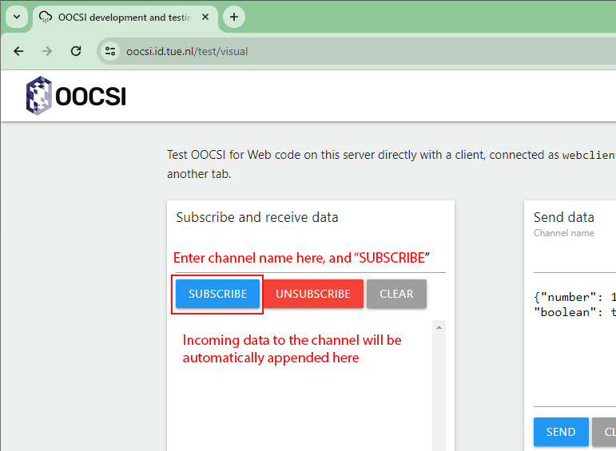

### Description

To check incoming data from a specific OOCSI channel, all you have to do is to subscribe to the channel on [OOCSI UI client page](https://oocsi.id.tue.nl/test/visual), and that's it.

 

## Source

All screenshot(s) are sourced from [OOCSI](https://oocsi.id.tue.nl/)