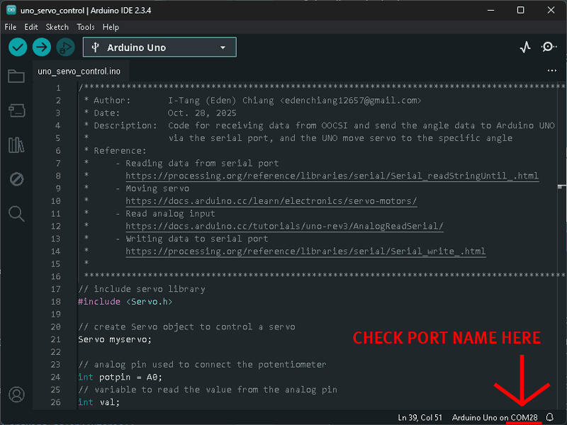

# Remote Servo Controller

A demo of controlling a servo remotely with a potentiometer via Arduino Uno, OOCSI, and Processing app.

## Setup

### Software

- [Arduino IDE](https://www.arduino.cc/en/software/) 2.3.4 or later, but not 2.3.5
- [Processing 4.4.8](https://processing.org/) or later version
- [OOCSI library](https://github.com/iddi/oocsi-processing)

### Required configurations 

- domain name of OOCSI server
- Channels of OOCSI for communication
- Unique OOCSI agent name
- Correct **COM port name for serial communication**, this can be checked in Processing app

## How to use

Choose either seperate mode or integrate mode, then follow the steps:

- First, build Arduino prototype by following the tutorials in Reference, and upload the code
- Second, replace the `OOCSI server domain name`, `OOCSI agent name`, and `channel name` in Processing apps, then run the apps

### I. Seperate Mode

After uploading the uno-xxx files to the Arduino prototype, open the servo / potentiometer side corresponding Processing apps, both of which can be run on the same machine without issues only for exactly match of:

- `port name` in Arduino prototype and Processing app, and 
- `channel name` for communicating in the Processing apps

Then the servo will move as potentiometer changes.

#### Servo Side

- Hardware:
  - Arduino UNO x 1
  - Servo x 1, model: SG90, move range: 0 - 180 degree
  - Capacitor x 1, 25V 100uF (optional)
  - Jumper wires x n
- Files
  - Arduino prototype: `oocsi_receiver_servo`
  - Processing app: `uno_serial-input_servo`
  
#### Potentiometer Side

- Hardware
  - Arduino UNO x 1
  - Potentiometer x 1
  - Jumper wires x n
- Files 
  - Arduino prototype: `oocsi_sender_potmeter`
  - Processing app: `uno_serial-output_potmeter`

### II. Integrate Mode

In this mode, all the users can send messages to others, then if there is no new messages, the servo will move back to the position where the potentiometer is.

- Hardware
  - Arduino UNO x 2
  - Potentiometer x 1
  - Servo x 1, model: SG90, move range: 0 - 180 degree
  - Capacitor x 1, 25V 100uF (optional)
  - Jumper wires x n
  - Breadboards x 1
- Files 
  - Arduino prototype: `oocsi_servo_control`
  - Processing app: `uno_serco_control`

## FAQ

- Nothing happened to my servo?

  A. Few things to check:

  - First thing to check is make sure the Processing apps are communicating via the **same channel**!!

  - Second, check the **`COM port`**, make sure the COM ports for each Arduino board is the same as linked in eash Processing app.
      - In Processing app

      

      - In Arduino IDE

      

  - Third, check the type of the data as reading messages from OOCSI, in this case, it should be an integer.

- What about the rest of the files: `oocsi_auto_sender`, and `UNO_Knob`?
  
  - `oocsi_auto_sender`: This Processing app will periodically send OOCSI messages, then user can check whether the receiver (server) side is working fine.
  - `UNO_Knob`: This Arduino Uno example can be found on the [official tutorial](https://www.arduino.cc/en/Tutorial/Knob/) , I made some minor changes that the potentiometer value will be sent out only if it's different from the previous value.
    

## Reference

- [ChannelSender](https://github.com/iddi/oocsi-processing/tree/master/dist/oocsi/examples/Connectivity/ChannelSender), the example code in OOCSI library for sending messages
- [ChannelReceiver](https://github.com/iddi/oocsi-processing/tree/master/dist/oocsi/examples/Connectivity/ChannelReceiver), the example code in OOCSI library for sending messages
- [Serial port check in Processing app](https://processing.org/reference/libraries/serial/Serial_list_.html)
- [Writing data to serial port with Arduino UNO](https://processing.org/reference/libraries/serial/Serial_write_.html)
- [Reading data from serial port with Arduino UNO](https://processing.org/reference/libraries/serial/Serial_readStringUntil_.html)
- [Controlling a servo position using a potentiometer](http://www.arduino.cc/en/Tutorial/Knob)
